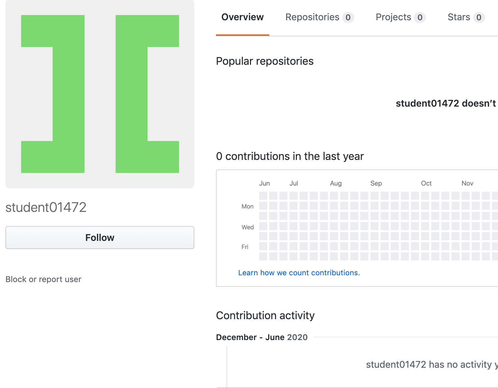
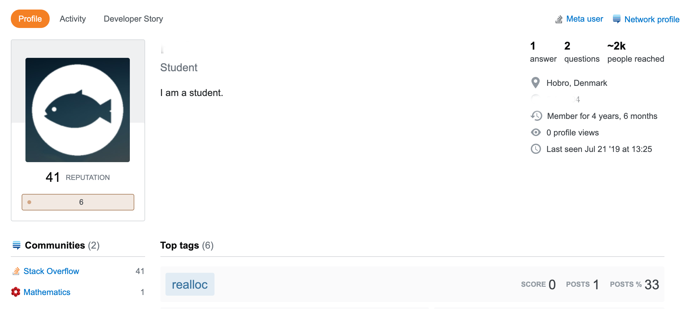
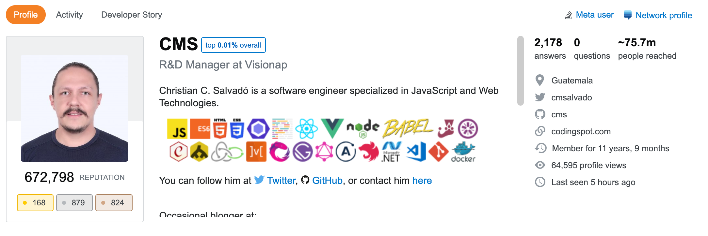

You can confidently hire a software developer without knowing anything about code yourself. The easiest way to do so is by assessing the developer’s public reputation. Here’s how to find and apply that information.

### Client Reviews

Accessing unfiltered client reviews of a developer (not testimonials) is the best indicator of his/her work quality. If you're using a marketplace like Freelancer, UpWork, or Fiverr, the developer's reviews are easy to find. If not, find those reviews yourself. If you know who the past clients are, reach out to them directly. If not, ask the developer to share their contact information. Focus on the interpersonal rather than technical comments. It's a lot easier to learn a specific tech stack than it is to learn how to communicate effectively. 

### Peer Reviews
Developers are hard to please. So, a dev who has built a strong reputation among peers is likely to have solid technical skills. You can find dev reputations on Stack OverFlow and GitHub. 

#### [Stack Overflow](https://stackoverflow.com/)
This is a coding-specific Q&A forum that every developer uses. It's extremely likely that your developer has a Stack OverFlow profile. Find it and look for:
- Relative ranking (top x% overall)
- Total points
- Number questions answered
- Number people reached
- The topics they've worked with. Are they relevant for your current project?

    

        <figure>
            
        </figure>
        
Not confidence inspiring

    

    

        <figure>
            
        </figure>
        
Very impressive

    

#### [GitHub](https://github.com/)

This is the most popular place where developers store their code. Find their profile and look for:
- Number of followers
- Commonly used coding languages (do they match your product's chosen language?)
- Number of repositories
- Repository size (look for at least one significant project)
- How long they've been active
- Organizations they belong to

    

        <figure>
            
        </figure>
        
Meh

    

    

        <figure>
            
        </figure>
        
A+++

    

>A bare Stack OverFlow or GitHub profile does not make someone a bad developer. But a strong one is a near-guarantee that someone is a good developer.