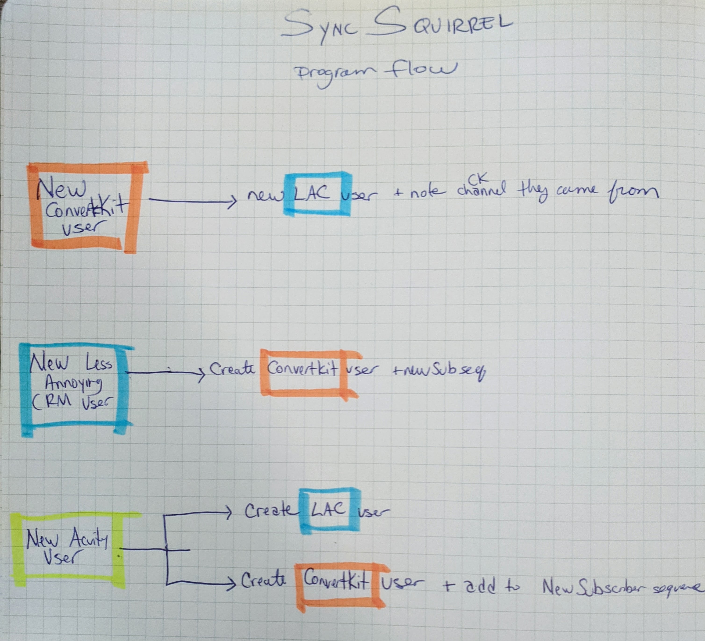

### What It Does

This project automates the tedious task of keeping user emails up-to-date across three systems: an email system, a scheduling system, and a CRM.

**The Problem:**
It's time-consuming and soul-crushing to sync emails manually. So, it doesn't get done. As a result, my client's marketing campaigns weren't as successful as they could've been, because they weren't sending targeted emails to many of their users.

**The Solution:**
A background app that continuously checks for any new users and immediately updates the other systems once it finds any.

### How It Works

The program uses a combination of UI automation and API calls to get the current user data for each system. Then, it compares those users to the users list from the previous run. If there are any new users, it adds them to the other two systems. The image below demonstrates the conditional logic that is used.

#### Tech Stack

- Python
- Selenium Web Driver
- ConvertKit
- Less Annoying CRM
- Acuity

### Lessons Learned

I discuss some of the hard lessons learned in-depth in [this behind the scenes video](https://www.youtube.com/watch?v=Dt4yB8kk4vs), but here's the summary:

1. When building proof-of-concept, just do the easiest thing -- don't worry about the edge cases yet.

2. Decide how to package the app up front instead of waiting until development is done. Doing so will make deployment and testing easier.

### Links
[Behind The Scenes Videos](https://www.youtube.com/playlist?list=PLrqlY5j4-vQMXfZe-UQP-jrFebYJuqUI_) - Shows the development process. Accompanied by striking commentary.

[Source Code (GitHub)](https://github.com/tyler-hitzeman/sync-squirrel)
